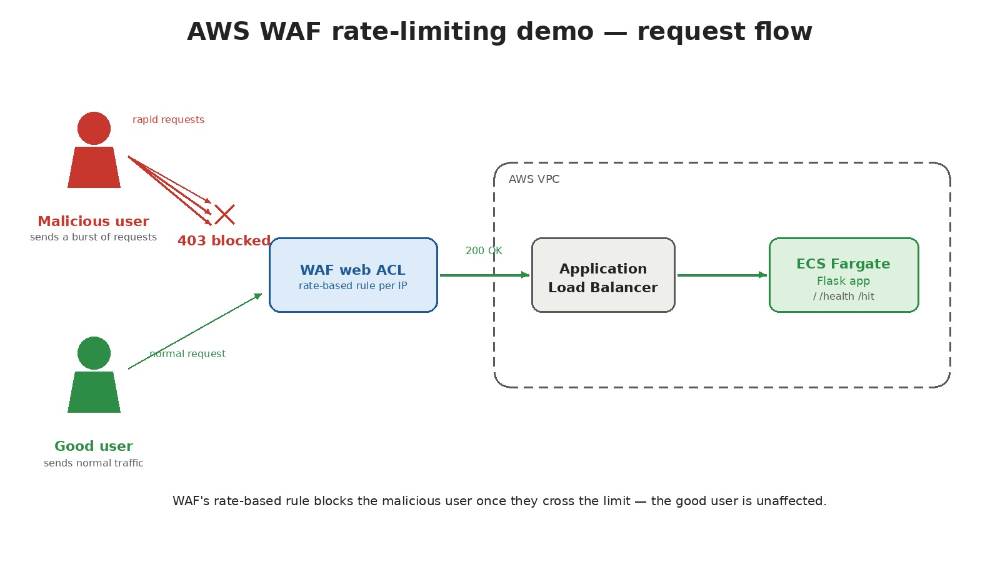

# AWS WAF Rate-Limiting Demo

A small, disposable AWS environment that makes rate limiting *visible*: a
tiny Flask app on ECS Fargate behind an Application Load Balancer, protected
by an AWS WAFv2 Web ACL with a rate-based rule. A load-test script hammers
the app until requests flip from `200` to `403` in real time.



Shield Standard is automatically active on the ALB at no extra cost
(basic L3/L4 DDoS protection). This demo does **not** use Shield Advanced
(~$3,000/month, 1-year commitment) — it isn't needed to demonstrate
request-rate limiting, which is a WAF (L7) feature.

## What's in here

```
app/                  Flask app + Dockerfile
01-network/            Phase 1: VPC, subnets, security groups
02-ecs/                 Phase 2: ECR, ECS cluster/service, ALB
03-waf/                 Phase 3: WAFv2 Web ACL + rate-based rule
scripts/load-test.sh    Load generator that makes rate limiting visible
deploy.sh               Applies phases 1 -> 2 -> 3 in order
destroy.sh              Tears down phases 3 -> 2 -> 1 in reverse order
```

Each phase is an independent Terraform root module with its own local
state — no remote backend, no `module {}` abstraction. That keeps each
phase easy to read, apply, and tear down on its own while still enforcing
a clear rollout order (network before compute before WAF).

## Prerequisites

- Terraform >= 1.5
- AWS CLI v2, configured with credentials that can create VPC/ECS/ALB/ECR/WAF resources
- Docker with `buildx` (for building the `linux/amd64` image pushed to ECR)
- `bash`, `curl`, `xargs` (all standard on Linux/macOS)

## Deploy

```bash
export AWS_REGION=us-east-1   # optional, defaults to us-east-1
./deploy.sh
```

This runs, in order:

1. **`01-network`** — VPC, 2 public subnets (2 AZs), internet gateway, route
   table, and security groups (ALB: 80/tcp from anywhere; ECS tasks: container
   port from the ALB security group only).
2. **`02-ecs`** — creates the ECR repo first, builds and pushes the Docker
   image (`linux/amd64`, matching Fargate's default architecture regardless
   of your build machine's CPU), then applies the ECS cluster, task
   definition, service, and ALB/target group/listener.
3. **`03-waf`** — creates a regional WAFv2 Web ACL with a rate-based rule
   and associates it with the ALB.

At the end, `deploy.sh` prints the ALB's DNS name and a ready-to-run
load-test command.

## Feel the rate limit

```bash
./scripts/load-test.sh <ALB_DNS_NAME>
```

You'll see a live stream of status codes — green `200`s while under the
limit, turning to red `403`s once WAF starts blocking — followed by a
summary: total requests, `200` count, `403` count, and the request number
where the first block occurred.

```
./scripts/load-test.sh <ALB_DNS_NAME> -n 1000 -c 40   # send more, faster
```

If you see zero `403`s, wait ~1 minute (WAF association can take a moment
to propagate) and try again, or increase `-n`/`-c`.

## Configuring the limit

The rate limit is a Terraform variable in `03-waf`, no code changes needed:

| Variable                | Default | Meaning                                                    |
|--------------------------|---------|-------------------------------------------------------------|
| `rate_limit_requests`    | `100`   | Max requests per source IP allowed within the window (min 10) |
| `evaluation_window_sec`  | `60`    | Rolling window WAF evaluates against — one of 60/120/300/600 |

To try a different threshold:

```bash
cd 03-waf
terraform apply -var="alb_arn=$(cd ../02-ecs && terraform output -raw alb_arn)" \
                 -var="rate_limit_requests=20" \
                 -var="evaluation_window_sec=60"
```

A lower `rate_limit_requests` / shorter `evaluation_window_sec` makes the
block trigger faster and is easier to demo live. WAF re-evaluates roughly
every 10 seconds, so blocking becomes visible shortly after the threshold
is crossed — it isn't instantaneous per-request.

## Verifying each phase

**After phase 1:**
```bash
cd 01-network && terraform output
```
Confirms a VPC and 2 subnets in different AZs.

**After phase 2 (before WAF):**
```bash
aws ecs describe-services --cluster <ecs_cluster_name> --services <ecs_service_name>
aws elbv2 describe-target-health --target-group-arn <target_group_arn>
curl http://<ALB_DNS_NAME>/health
curl http://<ALB_DNS_NAME>/
```

**After phase 3:**
```bash
aws wafv2 get-web-acl-for-resource --resource-arn <alb_arn>
```
Confirms the Web ACL is attached (allow ~1 minute for propagation).

**Cross-checking blocked requests via CloudWatch:**
```bash
aws cloudwatch get-metric-statistics \
  --namespace AWS/WAFV2 --metric-name BlockedRequests \
  --dimensions Name=WebACL,Value=waf-rate-demo-web-acl Name=Region,Value=$AWS_REGION Name=Rule,Value=rate-limit-rule \
  --start-time "$(date -u -d '-10 minutes' +%FT%TZ)" --end-time "$(date -u +%FT%TZ)" \
  --period 60 --statistics Sum
```
Or check the WAF console's "Sampled requests" view for the Web ACL.

## Cost

Roughly **$0.02–0.05/hour** while running: one ALB, one Fargate task
(256 CPU / 512 MiB), one WAF Web ACL + rule, and low-volume CloudWatch
Logs (1-day retention). No NAT gateway is used (tasks get public IPs
directly), which avoids its ~$0.045/hr cost.

## Cleanup

```bash
./destroy.sh
```

Tears down phases in reverse (WAF, then ECS/ALB/ECR, then network).
Always destroy after a demo session.

## Deliberate simplifications (not production-ready)

- ALB security group allows HTTP from `0.0.0.0/0` — fine for a demo, not for production.
- HTTP only, no ACM/HTTPS listener.
- Single ECS task, no autoscaling.
- No remote Terraform state / locking — local state per phase, meant for solo/teaching use.
